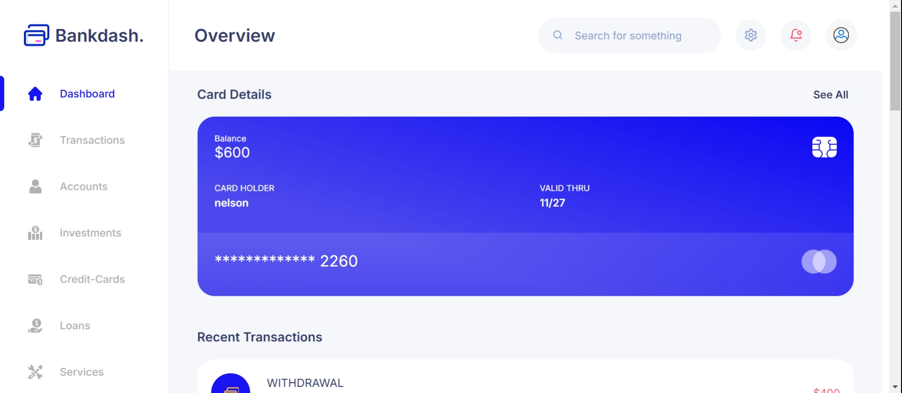
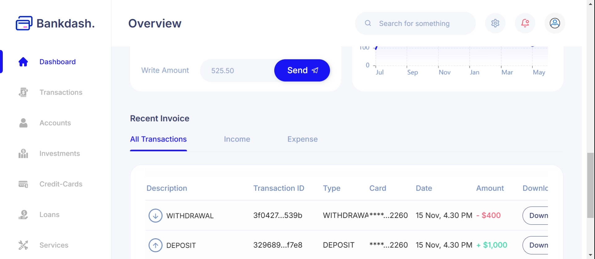
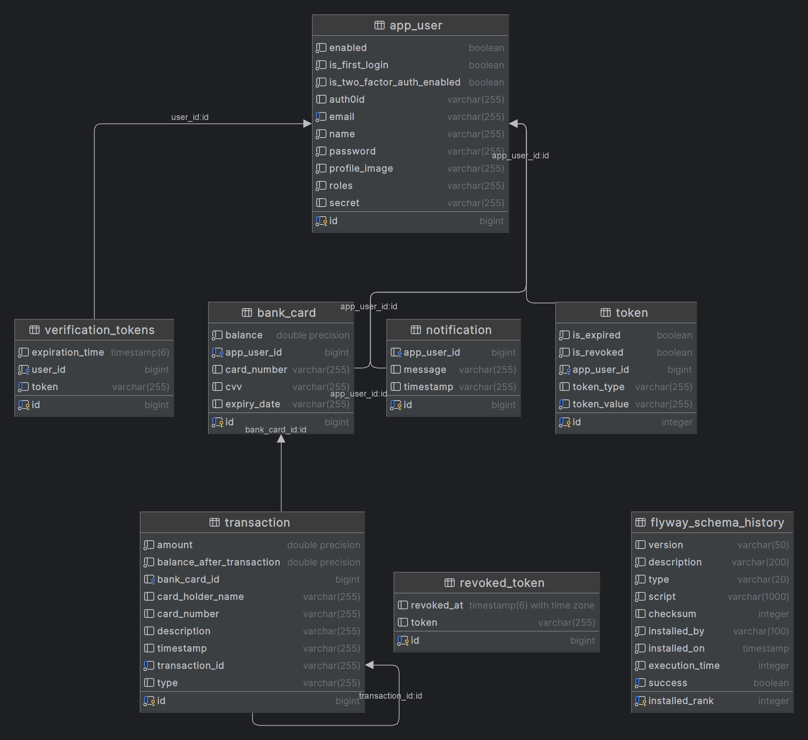

# BankDash Backend

## Table of Contents

- [Overview](#overview)
- [Features](#features)
- [Technologies Used](#technologies-used)
- [Learning Objectives](#learning-objectives)
- [License](#license)
- [Getting Started](#getting-started)
- [Contributors](#contributors)
- [Acknowledgments](#acknowledgments)

## Overview

BankDash is a backend application that enables users to create credit card, add funds, transfer funds and more. It offers features such as user registration, secure email validation, card creation (including funding, debiting, and transfer). The application ensures security using JWT tokens and adheres to best practices in REST API design. The backend is built with Spring Boot 3 and Spring Security 6, while the frontend is developed using React with Css for styling.

## Features

- User Registration: Users can register for a new account.
- Email Validation: Accounts are activated using secure email validation codes.
- User Authentication: Existing users can log in to their accounts securely.
- Card Creation: Users can add, debit and transfer funds.
- Email Sending: There is email sending feature
- Notification: There is notification feature
- Transaction: User recent transaction is recorded

#### Class diagram



#### Spring security diagram


#### Backend pipeline



## Technologies Used

### Backend (BackDash Project)

- kotlin
- Spring Boot 3
- Spring Security 6
- JWT Token Authentication with auth0
- Spring Data JPA
- Spring Validation
- OpenAPI and Swagger UI Documentation
- Docker
- GitHub Actions


## Getting Started

## Setup Instructions

To set up the backend of the Book BankDash project, follow these steps:

1. Clone the repository:

```bash
   git clone https://github.com/Nelsonobazee12/Backend.git
   
   cd Backend
```

2. Pull the Docker Image

```bash
  docker pull nelsonobazee12518/backend:latest
```
3. Run the Docker Image

```bash
  docker run -d -p 8080:8080 nelsonobazee12518/backend:latest
```

4. Access the API documentation using Swagger UI:

Open a web browser and go to `http://localhost:8080/swagger-ui/index.html.

## Access the frontend here

- https://github.com/Nelsonobazee12/bankdash

## License

This project is licensed under the Apache License 2.0. See the [LICENSE](LICENSE) file for details.

## Contributors

- [Nelsonobazee12](https://github.com/Nelsonobazee12)

## Acknowledgments

Special thanks to the developers and maintainers of the technologies used in this project. Their hard work and dedication make projects like this possible.